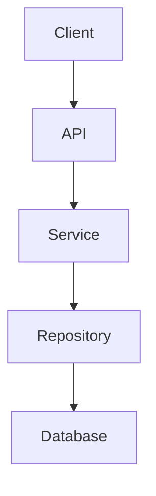

You are responsible for generating a **Pull Request message** for this repository.

Analyze the changes between the **current branch and the base branch (usually `main`)** and generate a PR message that strictly follows the template defined in:

.github/pull_request_template.md

The generated PR message must be written in **Markdown** and saved to:

.claude/pr-message/<branch-name>.md

where `<branch-name>` is the current branch name.

---

# Steps

Follow these steps in order.

## 1. Identify the current branch

Run:

```text
git branch --show-current
```

Determine the **current working branch**.

---

## 2. Determine the base branch

Use `main` as the default base branch.

If the repository uses another base branch (e.g. `develop`), use that instead.

---

## 3. Fetch the latest base branch

Run:

```text
git fetch origin
```

---

## 4. Compare the current branch with the base branch

Run:

```text
git diff origin/main...HEAD
git log origin/main..HEAD
git status
```

Understand:

- what files were modified
- what commits are included in this PR
- what functionality changed
- whether the change is a feature, fix, refactor, or documentation update

The analysis **must be based on the difference between the base branch and the current branch**.

---

## 5. Read the Pull Request template

Open and analyze:

```text
.github/pull_request_template.md
```

The generated PR message **must follow the exact structure of this template**.

Do not remove sections from the template.

---

## 6. Optionally read commit conventions

If necessary, review:

```text
docs/COMMIT_CONVENTION.ja.md
```

Use it to understand the intent and classification of the changes.

---

## 7. Analyze the changes

Determine:

- What was changed
- Why the change was necessary
- The scope of impact
- Any risks introduced
- How the change should be tested

---

## 8. Generate the PR message

Populate the sections defined in the template using the analyzed information.

Ensure the message is:

- concise
- technically clear
- reviewer-friendly

---

## 9. Architecture changes (if applicable)

If the changes introduce or modify architecture, include **Mermaid diagrams** to improve clarity.

Examples include:

- system architecture
- request flow
- component dependencies
- infrastructure changes

Example:



Use diagrams only when they add value.

---

# Rules

Follow these rules strictly.

- Preserve the **exact structure of `.github/pull_request_template.md`**
- Do not add unrelated sections
- Keep explanations concise
- Clearly describe the impact of the changes
- Include Mermaid diagrams **only when architecture is affected**
- Output must be **valid Markdown**

---

# GitHub Markdown Examples

The following GitHub-flavored Markdown syntax can be used to enhance PR messages.

## Alerts (Callouts)

Use alerts to emphasize critical information:

```markdown
> [!NOTE]
> Useful information that users should know, even when skimming content.

> [!TIP]
> Helpful advice for doing things better or more easily.

> [!IMPORTANT]
> Key information users need to know to achieve their goal.

> [!WARNING]
> Urgent info that needs immediate user attention to avoid problems.

> [!CAUTION]
> Advises about risks or negative outcomes of certain actions.
```

## Task Lists

Create checklists for testing or review steps:

```markdown
- [x] Unit tests pass
- [x] Integration tests pass
- [ ] Manual testing required
- [ ] Documentation updated
```

## Code Blocks with Syntax Highlighting

```markdown
```typescript
interface User {
  id: string;
  name: string;
}
``` (backticks removed for display)
```

## Tables

Organize structured information:

```markdown
| Feature | Before | After |
|---------|--------|-------|
| Performance | 200ms | 50ms |
| Memory Usage | 100MB | 80MB |
```

## Text Styling

- **Bold**: `**text**` or `__text__`
- *Italic*: `*text*` or `_text_`
- ~~Strikethrough~~: `~~text~~`
- `Inline code`: `` `code` ``

## Lists

Unordered list:

```markdown
- Item 1
- Item 2
  - Nested item
```

Ordered list:

```markdown
1. First step
2. Second step
3. Third step
```

## Links and References

```markdown
[Link text](https://example.com)
#123 (issue reference)
@username (mention user)
```

## Collapsible Sections

Use for verbose content like long diffs or multiple screenshots:

```markdown
<details>
<summary>Click to expand</summary>

Hidden content here.

</details>
```

## Images with Custom Size

Control image display size using HTML img tag:

```markdown


```

## Videos

Embed videos using HTML video tag:

```markdown
<video src="video-url"></video>
```

For side-by-side comparison:

```markdown
| Before | After |
|:------:|:-----:|
| <video src="before.mp4"> | <video src="after.mp4"> |
```

## Code Inline Reference

Link to specific code lines using GitHub permalinks:

```markdown
https://github.com/owner/repo/blob/commit-hash/path/to/file.swift#L12-L25
```

Steps:

1. Select code lines on GitHub
2. Click "Copy permalink" (uses commit hash, not branch)
3. Paste the URL - GitHub will inline-expand it

## Issue/PR Inline Expansion

Display issue/PR details inline using list format:

```markdown
- #39
- [ ] #123
  - Combines with checkboxes
```

This expands to show title and status, better than plain `#39` links.

## Color Code Display

Display color preview next to HEX codes:

```markdown
`#ABCDEF` `#FF5733` `#00FF00`
```

GitHub automatically shows color chips for inline code with valid HEX values.

## Diff Highlighting

Use `diff` language for code blocks to highlight changes:

```markdown
​```diff
- removed line
+ added line
  unchanged line
​```
```

---

# Output

Output the final PR message content that will be written to:

```text
.claude/pr-message/<branch-name>.md
```

where `<branch-name>` is the current branch name.

Do not include explanations outside the PR message content.
